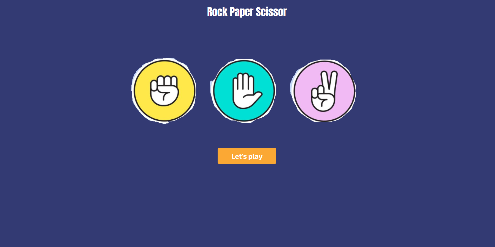
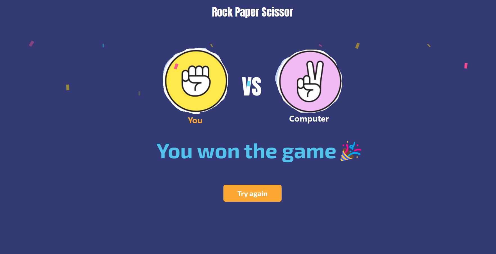

# Rock Paper Scissors Game

This is a simple Rock Paper Scissors game built using React.js and Tailwind CSS. The game allows users to play against the computer and keep track of their score.


## Table of Contents
- [Screenshots](#screenshots)
- [Installation](#installation)
- [Usage](#usage)
- [Features](#features)

## Screenshots
- **ScreenShot 1**
  
- **ScreenShot 2**  
  
- **ScreenShot 3**  
  


## Installation

1. Clone the repository:

```bash
git clone https://github.com/san1234100/rock-paper-scissor-game.git
```
2. Navigate into the project directory:
```bash
cd rock-paper-scissor-game
```

3. Install dependencies using npm or yarn:
```bash
npm install
```

4. Start the development server:
```bash
npm run dev
```


## Usage
- Once the development server is running, you can access the game in your web browser at http://localhost:3000. 
- Follow the on-screen instructions to play the game.

## Features
- Play Rock Paper Scissors against the computer
- Keep track of the player's score
- Attractive design using Tailwind CSS


# Happy coding!😁🧑‍💻